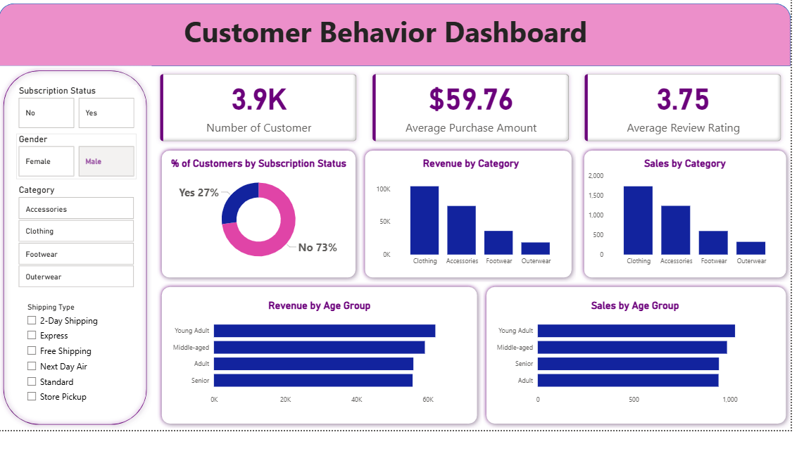

# 🛍️ Customer Shopping Behavior Analysis – Retail Purchase & Subscription Insights

Analyzing customer patterns, segmentation, and the impact of discounts and subscriptions to drive marketing and retention strategies using **SQL**, **Python**, and **Power BI**.

---

## 📌 Table of Contents

- [Overview](#overview)
- [Business Problem](#business-problem)
- [Dataset](#dataset)
- [Tools & Technologies](#tools--technologies)
- [Project Structure](#project-structure)
- [Data Cleaning & Preparation](#data-cleaning--preparation)
- [Exploratory Data Analysis (EDA)](#exploratory-data-analysis-eda)
- [SQL Business Insights](#sql-business-insights)
- [Research Questions & Key Findings](#research-questions--key-findings)
- [Dashboard](#dashboard)
- [How to Run This Project](#how-to-run-this-project)
- [Final Recommendations](#final-recommendations)


---

## 📊 Overview

This project analyzes **3,900 retail transactions** to uncover customer behavior trends, segment buyers, and evaluate how **discounts, subscriptions, and shipping choices** influence purchasing behavior. The goal is to generate actionable insights for **marketing optimization** and **customer loyalty strategies**.

---

## ❓ Business Problem

Retailers need to understand what drives customer spending and loyalty. This project aims to:

- Segment customers based on buying patterns  
- Assess the role of discounts and subscriptions  
- Identify profitable demographics and products  
- Recommend strategies for retention and growth  

---

## 📂 Dataset

**File:** `data/customer-shopping-behavior.csv`  
**Records:** 3,900 transactions  
**Attributes:** Demographics, product details, purchase amount, review ratings, shipping type, and subscription status  

---

## 🛠️ Tools & Technologies

- **Python:** pandas, matplotlib for cleaning, EDA, and visualization  
- **PostgreSQL:** advanced querying for behavioral and revenue insights  
- **Power BI:** dashboard for stakeholder-friendly reporting  

---

## 🗂️ Project Structure

```
customer-shopping-behavior/
├── SQL/                      # SQL queries and scripts
│   └── sql.sql
├── dashboard/                # Power BI file
│   └── power bi.pbix
├── data/                     # Dataset
│   └── customer-shopping-behavior.csv
├── images/                   # Visual preview
│   └── dashboard.png
├── notebooks/                # Python notebooks
│   └── Exploratory-data-analysis.ipynb
└── README.md                 # Documentation
```

---
## 🧹 Data Cleaning & Preparation

Filled missing review ratings using category-wise median values

Removed redundant columns such as promo_code_used after consistency checks

Created derived features for better segmentation and trend analysis:

age_group – binned ages into customer categories (Young Adult, Adult, Middle-aged, Senior)

purchase_frequency_days – derived from purchase timestamps to measure customer activity

Standardized categorical values and verified data types for accurate SQL and Power BI integration

Loaded cleaned data into PostgreSQL for advanced querying and business analysis

## 🧾 Outcome:
The dataset was fully cleaned, structured, and ready for SQL-based business insights and Power BI visualization.
This ensured that segmentation, revenue, and product analyses were based on accurate and reliable data.

---

## 💡 SQL Business Insights

- **Revenue Split:** Male customers dominate total revenue  
- **High-Value Discounts:** 839 customers used discounts yet exceeded average spend  
- **Top Products:** *Gloves*, *Sandals*, and *Boots* scored highest in average ratings  
- **Shipping Impact:** Express users show slightly higher purchase averages  
- **Subscriptions:** Subscribers generate higher revenue and average spend  
- **Customer Mix:** 80% *Loyal*, 8% *Returning*, 12% *New* customers  

---

## 🔍 Research Questions & Key Findings

| **Question**                                         | **Key Findings**                                               |
| ---------------------------------------------------- | -------------------------------------------------------------- |
| Who are the most loyal and high-frequency customers? | 80% identified as *Loyal*; strong overlap with subscribers.    |
| Which products perform best by rating and sales?     | *Gloves*, *Sandals*, *Jewelry*, *Jackets* lead across metrics. |
| Do discounts drive higher-value purchases?           | Yes — many discount users spent above the average.             |
| How do subscriptions influence spending?             | Subscribers spend more and purchase more frequently.           |
| What shipping method yields higher spend?            | Express shipping users slightly outspend standard ones.        |
| Which demographics are most profitable?              | Young adults and male customers contribute the most revenue.   |

---

## 📈 Dashboard

**Includes:**

- Customer segmentation and loyalty metrics  
- Revenue by gender, age group, and product  
- Discount and subscription impact  
- Shipping preferences and purchasing trends  

**File:** `dashboard/power bi.pbix`  

`  

---

## ⚙️ How to Run This Project

1. Clone the repository  
   ```bash
   git clone https://github.com/swarnali2001/customer-shopping-behavior.git  
   cd customer-shopping-behavior
   ```
2. Open dataset → `data/customer-shopping-behavior.csv`  
3. Run Python notebook → `notebooks/Exploratory-data-analysis.ipynb`  
4. Execute SQL queries → `SQL/sql.sql`  
5. View dashboard → `dashboard/power bi.pbix`  

---

## ✅ Final Recommendations

- Expand **subscription programs** to retain high-frequency buyers  
- Launch **loyalty rewards** for loyal segments  
- Optimize **discount strategy** for profit protection  
- Highlight **top-rated and best-selling** products in marketing  
- Focus on **young adult and express-shipping** demographics  

---
